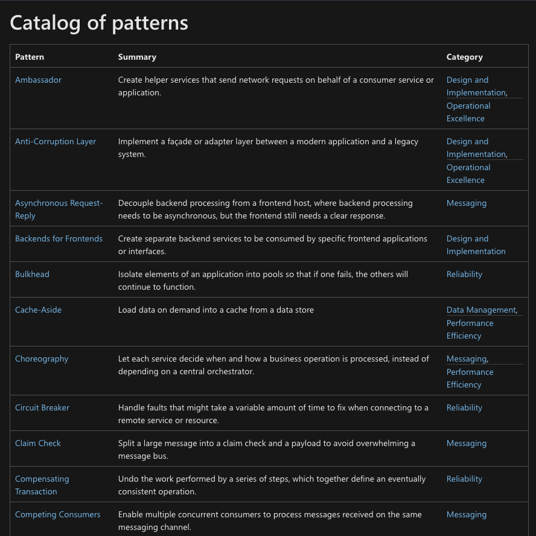

# Sidecar Pattern 

## Temporal Interview 

### Senior Technical Curriculum Developer

#### August 2022 
 
--- 

## Goals 
1. Define "sidecar pattern" 
1. Explain how to identify the sidecar pattern in a code repo 

---

## Hi! I'm Kim

--- 

## Prerequisites 
- "Hello World"
- You are interested in learning more about distributed systems development

--- 

## Goals 
1. Define "sidecar pattern" 
1. Explain how to identify the sidecar pattern in a code repo 

---

## Goals 
1. Define "sidecar pattern" 

---

### Design Patterns for Cloud Native 

Source: [Azure Cloud Design Patterns](https://docs.microsoft.com/en-us/azure/architecture/patterns/)

--- 
## Sidecar Pattern

Source: [Cycle World: 2021 Ural Gear Up Geo First Ride](https://www.cycleworld.com/story/motorcycle-reviews/2021-ural-gear-up-geo-sidecar-first-ride/)

---
## Sidecar Pattern

Source: [Azure Cloud Design Patterns: Sidecar Pattern](https://docs.microsoft.com/en-us/azure/architecture/patterns/sidecar)

---

## Sidecar Pattern

2 containers:  

1. main application 
1. helper application 

---

# Example 

---

## Goals 
1. Define "sidecar pattern" 
1. Explain how to identify the sidecar pattern in a code repo 

--- 
## Goals 
1. Define "sidecar pattern" 
1. Explain how to identify the sidecar pattern in a code repo 

---
## Goals 
1. Define "sidecar pattern" 
1. Explain how to identify the sidecar pattern in a code repo 

---

## Goals 
1. Define "sidecar pattern" 
1. Explain how to identify the sidecar pattern in a code repo 

---

## Recap 

--- 
# Sidecar Pattern
- main app and helper app
- The containers share resources on a host including CPU, memory, a file system and networking services

---
# In Code 
- 2 containers 
- Shared host
- (Optional) Different languages and operating systems 

--- 
## Goals 
1. Define "sidecar pattern" 
1. Explain how to identify the sidecar pattern in a code repo 

---

## Resources 
- [Designing Distributed Systems by Brendan Burns](https://azure.microsoft.com/mediahandler/files/resourcefiles/designing-distributed-systems/Designing_Distributed_Systems.pdf)
- [Azure Cloud Design Patterns: Sidecar Pattern](https://docs.microsoft.com/en-us/azure/architecture/patterns/sidecar)
- [ContainIQ: Kubernetes Sidecar Container | Best Practices and Examples](https://www.containiq.com/post/kubernetes-sidecar-container)

---

@kimschles